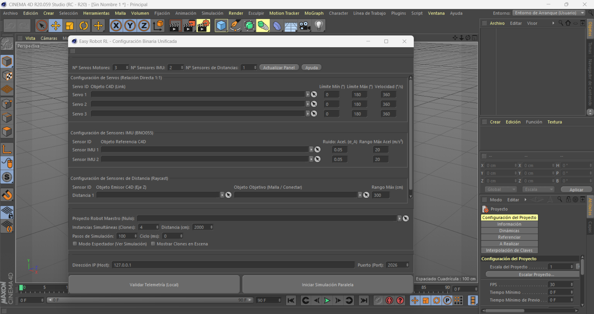

# 🇪🇸 Easy Robot RL: Cinema 4D To AMD ROCm AI Pipeline


[](https://opensource.org/licenses/MIT)
[](https://www.maxon.net/)
[](https://www.amd.com/en/products/software/rocm.html)
[](https://www.python.org/)


# 🇪🇸 Easy Robot RL: Cinema 4D To AMD ROCm AI Pipeline
**Easy Robot RL** es una herramienta y plugin de automatización para **Cinema 4D** desarrollado en Python. Permite transformar el entorno 3D en un simulador de robótica de alta velocidad para tareas de **Aprendizaje por Refuerzo (Reinforcement Learning)**. 

El proyecto destaca por su arquitectura agnóstica en la generación de entornos y su transmisión de datos ultra optimizada en binario (16-bit). Está diseñado específicamente para alimentar servidores de IA externos acelerados por **AMD ROCm / HIP SDK** en entornos Windows, eliminando los cuellos de botella tradicionales entre la CPU de diseño y la GPU de cómputo.

---

## 🔥 Características Principales

*   **Telemetría de Ultra Baja Latencia:** Serialización de datos en tiempo real mediante estructuras C nativas (`struct`), empaquetando la información en flujos binarios puros de 16 bits vía UDP.
*   **Gemelos Digitales y Clonación Dinámica:** Capacidad para generar instancias masivas de robots en coordenadas calculadas de forma matricial para el entrenamiento en paralelo de la IA.
*   **Fusión de Sensores Virtuales Integrada:** 
    *   **Actuadores (Servos):** Monitoreo angular exacto, límites geométricos configurables y cálculo adaptativo de velocidad (°/s).
    *   **Unidades de Medición Inercial (IMUs):** Simulación matemática de Pitch, Roll y vectores de Aceleración Lineal Dinámica ($m/s^2$) con inyección de ruido gaussiano configurable.
    *   **Sensores Ópticos:** Cálculo de distancias mediante colisiones de rayos láser virtuales de alta velocidad (*Raycasting* con `GeRayCollider`).
*   **Pipeline Verificado para AMD:** Estructura de red optimizada para alimentar modelos de PyTorch configurados sobre hardware **AMD Radeon y aceleradores con Ryzen AI**.

---

##  Arquitectura del Pipeline de Datos

El script se comporta como el **Entorno de Simulación (Environment)**. No requiere recursos gráficos pesados de la GPU para calcular las físicas básicas y distancias, lo que permite reservar toda la potencia de tu tarjeta gráfica AMD para el entrenamiento del modelo.

```text
+-----------------------------------+             UDP Socket             +-----------------------------------+

|      Cinema 4D (Simulation)       |         (Binary Payload)           |      AI Server (Training)         |
|  - Real-time Matrix Cloning       |  ------------------------------->  |  - Windows + AMD ROCm / HIP SDK   |
|  - 16-bit Structured Telemetry    |       Host IP: 127.0.0.1:2026      |  - PyTorch Tensor Acceleration     |
|  - Custom GUI & Persistence (BC)  |                                    |  - Stable-Baselines3 / PPO / SAC  |
+-----------------------------------+                                    +-----------------------------------+
```

---

##  Instalación y Uso rápido

### 1. En Cinema 4D:
1. Descarga el archivo de este repositorio.
2. Coloca la carpeta del plugin en el directorio de extensiones de Cinema 4D:
   `C:\Usuarios\<Tu_Usuario>\AppData\Roaming\Maxon\Cinema 4D <Versión>\plugins\`
3. Reinicia Cinema 4D y abre el panel desde el menú de *Extensiones -> Easy Robot RL*.

### 2. Formato del Payload Binario (Red UDP)
Cada paquete enviado por el socket UDP sigue el siguiente estándar secuencial para una lectura instantánea en C/Python externo:
*   **Cabecera (Header):** Paso de simulación (`uint16`), Entornos reales (`uint16`), Cantidad de Servos (`uint8`), Cantidad de IMUs (`uint8`), Cantidad de Láseres (`uint8`).
*   **Por cada Clon/Instancia:**
    *   ID del clon (`uint8`).
    *   Ángulos de Servos normalizados (`uint16`).
    *   Datos IMU (`int16` para orientación y aceleraciones multiplicadas por factor de escala).
    *   Distancia de Raycast normalizada (`uint16`).

---

##  Integración con AMD ROCm (Ejemplo de Receptor)

Para capturar y enviar estos datos directamente a tu tarjeta gráfica AMD mediante **PyTorch**, puedes utilizar el siguiente enfoque en tu script de entrenamiento externo:

```python
import socket
import struct
import torch
import sys

def inicializar_entorno_amd():
    print("=" * 65)
    print("       VERIFICACIÓN AVANZADA DE TOPOLOGÍA AMD GPU (ROCm/HIP)      ")
    print("=" * 65)
    
    # Validar disponibilidad física del silicio Radeon
    if not torch.cuda.is_available():
        print("[ERR] No se detectó hardware compatible con aceleración HIP/ROCm.")
        sys.exit("[SISTEMA] Abortando inicialización. Revisa los controladores AMD.")

    # 1. Metadatos de Identificación de Hardware
    nombre_gpu = torch.cuda.get_device_name(0)
    id_dispositivo = torch.cuda.current_device()
    propiedades = torch.cuda.get_device_properties(id_dispositivo)
    
    # 2. Métricas de Memoria en Tiempo Real (Conversión de bytes a Gigabytes)
    mem_libre_bytes, mem_total_bytes = torch.cuda.mem_get_info()
    vram_total = mem_total_bytes / (1024 ** 3)
    vram_libre = mem_libre_bytes / (1024 ** 3)
    vram_en_uso = vram_total - vram_libre

    # 3. Datos del Entorno de Ejecución (Backend)
    rocm_version = torch.version.hip if hasattr(torch.version, 'hip') else "HIP Native Bindings"
    arquitectura_sm = f"{propiedades.major}.{propiedades.minor}"

    # Imprimir panel expandido de información de la GPU
    print(f"[HARDWARE] Tarjeta Gráfica : {nombre_gpu}")
    print(f"[HARDWARE] Índice de Unidad: GPU_ID: {id_dispositivo}")
    print(f"[HARDWARE] Capacidad Cómputo: HIP CC {arquitectura_sm} (RDNA Architecture)")
    print("-" * 65)
    print(f"[SOFTWARE] Versión de Python: {sys.version.split()[0]}")
    print(f"[SOFTWARE] PyTorch Backend : ROCm/HIP v{rocm_version}")
    print("-" * 65)
    print(f"[MEMORIA]  VRAM Total      : {vram_total:.2f} GB")
    print(f"[MEMORIA]  VRAM Libre      : {vram_libre:.2f} GB")
    print(f"[MEMORIA]  VRAM Asignada   : {vram_en_uso:.2f} GB")
    print("=" * 65)
    print("[ESTADO] ¡GPU AMD validada para entrenamiento paralelo de IA! 🔥\n")

    return torch.device("cuda")

def iniciar_servidor_receptor(device):
    UDP_IP = "127.0.0.1"
    UDP_PORT = 2026
    
    sock = socket.socket(socket.AF_INET, socket.SOCK_DGRAM)
    sock.bind((UDP_IP, UDP_PORT))
    
    print("-" * 65)
    print(f" Servidor escuchando telemetría binaria en {UDP_IP}:{UDP_PORT}")
    print(" Ejecuta la simulación en Cinema 4D para inyectar datos...")
    print("-" * 65)
    
    try:
        while True:
            # Capturar el datagrama binario de la red
            payload, addr = sock.recvfrom(4096)
            
            # Desempaquetar la cabecera fija de 7 bytes (<HHBBB)
            cabecera_datos = struct.unpack("<HHBBB", payload[:7])
            step, clones, n_servos, n_imus, n_lasers = cabecera_datos
            
            # Carga instantánea de tensores en la GPU AMD RX 9070 XT
            tensor_cabecera = torch.tensor(cabecera_datos, dtype=torch.float32).to(device)
            
            # Métricas dinámicas de uso de memoria interna de PyTorch
            vram_reservada_py = torch.cuda.memory_reserved(0) / (1024 ** 2) # en MB
            
            # Imprimir salida limpia con métricas de la simulación y de la GPU integradas
            print(f"[TELEMETRÍA] Frame: {step:05d} | Entornos Paralelos: {clones}")
            print(f"             └─ Sensores -> Servos: {n_servos} | IMUs: {n_imus} | Láseres: {n_lasers}")
            print(f"[GPU METRICS] Alloc Device: {tensor_cabecera.device} | Caché Reservada PyTorch: {vram_reservada_py:.2f} MB\n")
            
    except KeyboardInterrupt:
        print("\n[SISTEMA] Deteniendo servidor de forma segura...")
    finally:
        sock.close()

if __name__ == "__main__":
    # Inicializar diagnósticos avanzados de la GPU AMD
    target_device = inicializar_entorno_amd()
    
    # Escuchar la tubería de datos de Cinema 4D
    iniciar_servidor_receptor(target_device)
```
```Salida del Terminal:
=================================================================
       VERIFICACIÓN AVANZADA DE TOPOLOGÍA AMD GPU (ROCm/HIP)      
=================================================================
[HARDWARE] Tarjeta Gráfica : AMD Radeon RX 9070 XT               
[HARDWARE] Índice de Unidad: GPU_ID: 0                            
[HARDWARE] Capacidad Cómputo: HIP CC 12.0 (RDNA Architecture)    
-----------------------------------------------------------------
[SOFTWARE] Versión de Python: 3.12.7                              
[SOFTWARE] PyTorch Backend : ROCm/HIP v7.2.53211-158bd99533      
-----------------------------------------------------------------
[MEMORIA]  VRAM Total      : 15.92 GB                            
[MEMORIA]  VRAM Libre      : 15.77 GB                            
[MEMORIA]  VRAM Asignada   : 0.15 GB                             
=================================================================
[ESTADO] ¡GPU AMD validada para entrenamiento paralelo de IA! 🔥  
                                                                 
-----------------------------------------------------------------
 Servidor escuchando telemetría binaria en 127.0.0.1:2026        
 Ejecuta la simulación en Cinema 4D para inyectar datos...       
-----------------------------------------------------------------
[TELEMETRÍA] Frame: 00001 | Entornos Paralelos: 2
             └─ Sensores -> Servos: 3 | IMUs: 1 | Láseres: 1
[GPU METRICS] Alloc Device: cuda:0 | Caché Reservada PyTorch: 2.00 MB
```
---

---
## 📄 Licencia

Este proyecto está bajo la Licencia MIT. Siéntete libre de usarlo, modificarlo y adaptarlo para tus propios desarrollos de robótica y simulación industrial.


## 🤝 Contribuciones y Comunidad

¡Las contribuciones son bienvenidas!
