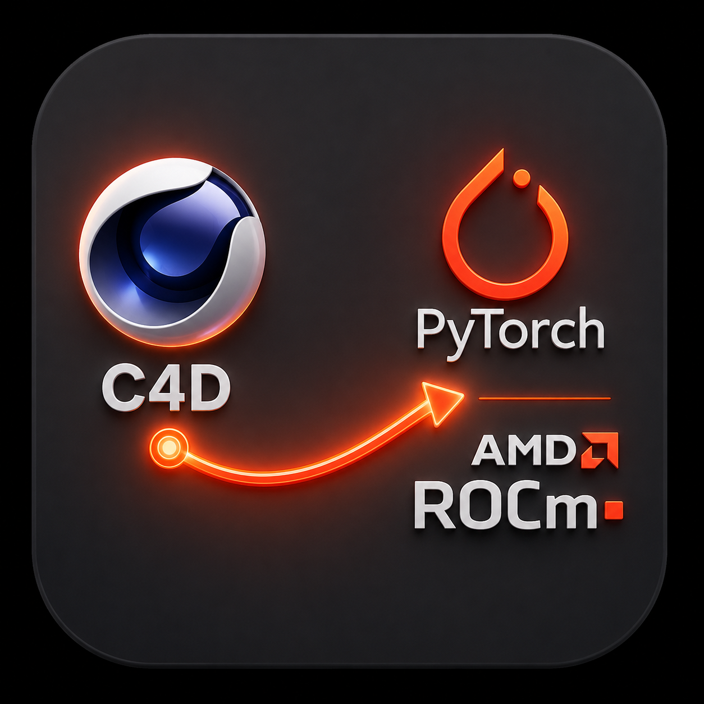

# Easy Robot RL: Cinema 4D To AMD ROCm AI Pipeline

[](https://opensource.org)
[](https://maxon.net)
[](https://amd.com)



**Easy Robot RL** es una herramienta y plugin de automatización para **Cinema 4D** desarrollado en Python. Permite transformar el entorno 3D en un simulador de robótica de alta velocidad para tareas de **Aprendizaje por Refuerzo (Reinforcement Learning)**. 

El proyecto destaca por su arquitectura agnóstica en la generación de entornos y su transmisión de datos ultra optimizada en binario (16-bit). Está diseñado específicamente para alimentar servidores de IA externos acelerados por **AMD ROCm / HIP SDK** en entornos Windows, eliminando los cuellos de botella tradicionales entre la CPU de diseño y la GPU de cómputo.

---

## 🔥 Características Principales

*   **Telemetría de Ultra Baja Latencia:** Serialización de datos en tiempo real mediante estructuras C nativas (`struct`), empaquetando la información en flujos binarios puros de 16 bits vía UDP.
*   **Gemelos Digitales y Clonación Dinámica:** Capacidad para generar instancias masivas de robots en coordenadas calculadas de forma matricial para el entrenamiento en paralelo de la IA.
*   **Fusión de Sensores Virtuales Integrada:** 
    *   **Actuadores (Servos):** Monitoreo angular exacto, límites geométricos configurables y cálculo adaptativo de velocidad (°/s).
    *   **Unidades de Medición Inercial (IMUs):** Simulación matemática de Pitch, Roll y vectores de Aceleración Lineal Dinámica ($m/s^2$) con inyección de ruido gaussiano configurable.
    *   **Sensores Ópticos:** Cálculo de distancias mediante colisiones de rayos láser virtuales de alta velocidad (*Raycasting* con `GeRayCollider`).
*   **Pipeline Verificado para AMD:** Estructura de red optimizada para alimentar modelos de PyTorch configurados sobre hardware **AMD Radeon y aceleradores con Ryzen AI**.

---

## 🛠️ Arquitectura del Pipeline de Datos

El script se comporta como el **Entorno de Simulación (Environment)**. No requiere recursos gráficos pesados de la GPU para calcular las físicas básicas y distancias, lo que permite reservar toda la potencia de tu tarjeta gráfica AMD para el entrenamiento del modelo.

```text
+-----------------------------------+             UDP Socket             +-----------------------------------+

|      Cinema 4D (Simulation)       |         (Binary Payload)           |      AI Server (Training)         |
|  - Real-time Matrix Cloning       |  ------------------------------->  |  - Windows + AMD ROCm / HIP SDK   |
|  - 16-bit Structured Telemetry    |       Host IP: 127.0.0.1:2026      |  - PyTorch Tensor Acceleration     |
|  - Custom GUI & Persistence (BC)  |                                    |  - Stable-Baselines3 / PPO / SAC  |
+-----------------------------------+                                    +-----------------------------------+
```

---

## 🚀 Instalación y Uso rápido

### 1. En Cinema 4D:
1. Descarga el archivo de este repositorio.
2. Coloca la carpeta del plugin en el directorio de extensiones de Cinema 4D:
   `C:\Usuarios\<Tu_Usuario>\AppData\Roaming\Maxon\Cinema 4D <Versión>\plugins\`
3. Reinicia Cinema 4D y abre el panel desde el menú de *Extensiones -> Easy Robot RL*.

### 2. Formato del Payload Binario (Red UDP)
Cada paquete enviado por el socket UDP sigue el siguiente estándar secuencial para una lectura instantánea en C/Python externo:
*   **Cabecera (Header):** Paso de simulación (`uint16`), Entornos reales (`uint16`), Cantidad de Servos (`uint8`), Cantidad de IMUs (`uint8`), Cantidad de Láseres (`uint8`).
*   **Por cada Clon/Instancia:**
    *   ID del clon (`uint8`).
    *   Ángulos de Servos normalizados (`uint16`).
    *   Datos IMU (`int16` para orientación y aceleraciones multiplicadas por factor de escala).
    *   Distancia de Raycast normalizada (`uint16`).

---

## 🧪 Integración con AMD ROCm (Ejemplo de Receptor)

Para capturar y enviar estos datos directamente a tu tarjeta gráfica AMD mediante **PyTorch**, puedes utilizar el siguiente enfoque en tu script de entrenamiento externo:

```python
import socket
import struct
import torch

# Forzar el uso del entorno ROCm / HIP de AMD en Windows
device = torch.device("cuda" if torch.cuda.is_available() else "cpu")
print(f"Entrenando en: {device} (Aceleración AMD habilitada)")

# Configurar socket receptor
UDP_IP = "127.0.0.1"
UDP_PORT = 2026
sock = socket.socket(socket.AF_INET, socket.SOCK_DGRAM)
sock.bind((UDP_IP, UDP_PORT))

while True:
    data, addr = sock.recvfrom(4096)
    # Ejemplo: Desempaquetar cabecera básica (2x H, 3x B = 7 bytes)
    header = struct.unpack("<HHBBB", data[:7])
    
    # Transformar a tensores y transferir directamente a la GPU AMD
    tensor_datos = torch.tensor(header, dtype=torch.float32).to(device)
    # Tu bucle de entrenamiento (PPO / SAC) va aquí...
```

---

## 📄 Licencia

Este proyecto está bajo la Licencia MIT. Siéntete libre de usarlo, modificarlo y adaptarlo para tus propios desarrollos de robótica y simulación industrial.

---

## 🤝 Contribuciones y Comunidad

¡Las contribuciones son bienvenidas! Si tienes optimizaciones para el backend de red o integraciones nativas con frameworks de RL orientados a hardware de AMD, abre un *Pull Request* o inicia un *Issue*.
